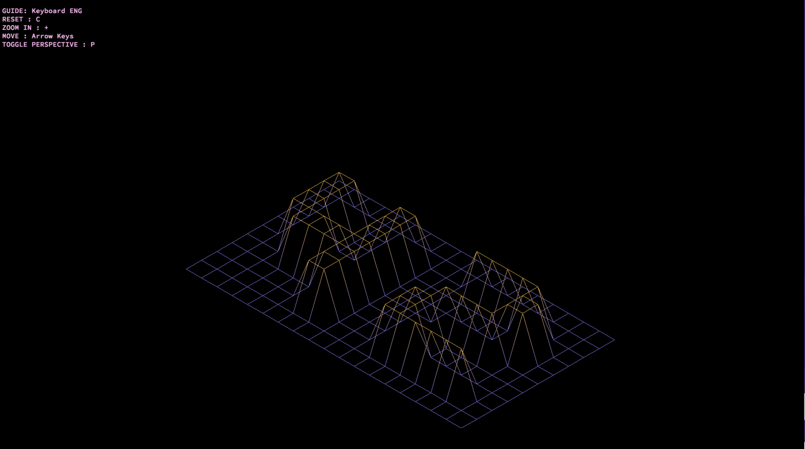
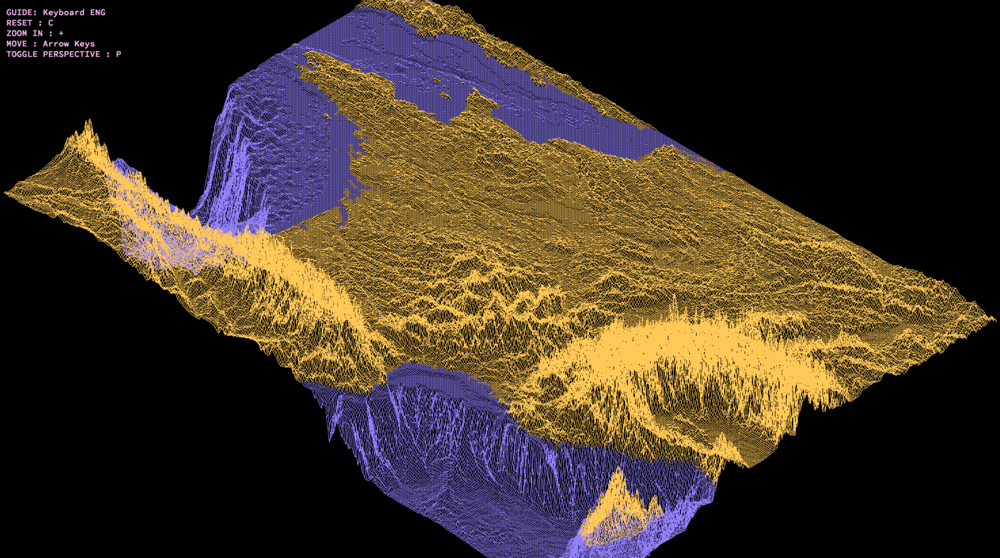

# Wireframe Model of 3D Landscape

## Project Overview
This project, titled **FDF**, is a basic computer graphics program written in C. The goal of the project is to create a simple wireframe model representation of a 3D landscape by linking various points in 3D space using line segments. The project makes use of the MiniLibX, a simple graphics library, to handle window management, rendering, and user interactions.
## Screenshots






## Key Features
- **Isometric Projection:** The 3D landscape is displayed using an isometric projection for clear visualization.
- **Landscape Representation:** The landscape is represented using a `.fdf` file format, where each value corresponds to the altitude at a given point on a grid.
- **Basic Graphic Operations:** The program handles window creation, rendering of the wireframe model, and interaction such as quitting via keyboard or window controls.
  
## Requirements
- C programming language
- MiniLibX library
- Math library (-lm)
- A properly formatted `.fdf` file as input
- x86 processor 

## Installation
1. Clone the repository:
    ```bash
    git clone https://github.com/your-repo/fdf.git
    ```
2. Build the project:
    ```bash
    cd fdf
    make
    ```

## Usage
To run the program, use the following command:
```bash
./fdf <file.fdf>
```
There are some map examples on test_maps
## Controls 
- ESC key: Exit the program
- Window close button: Quit and close the window
- Zooming in and out
- Rotating and translating the model

